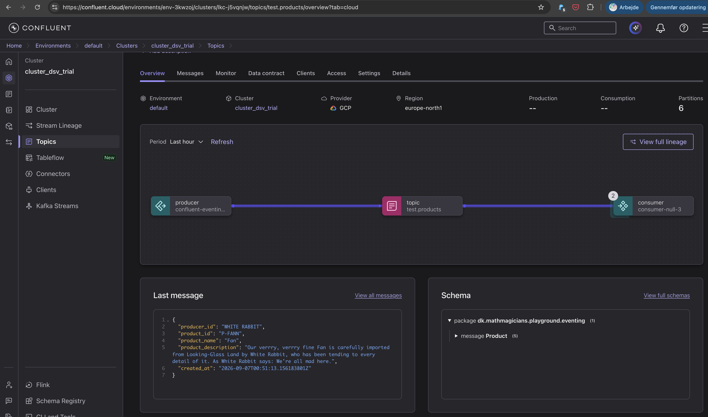
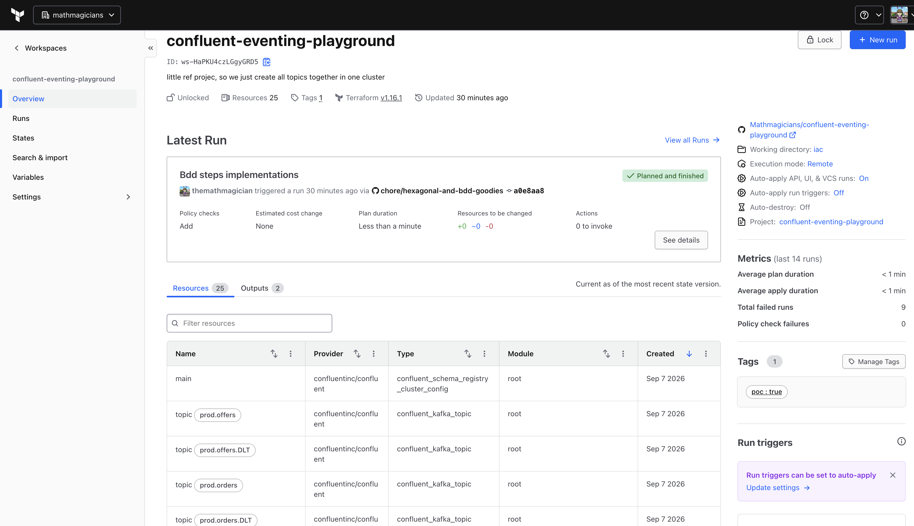
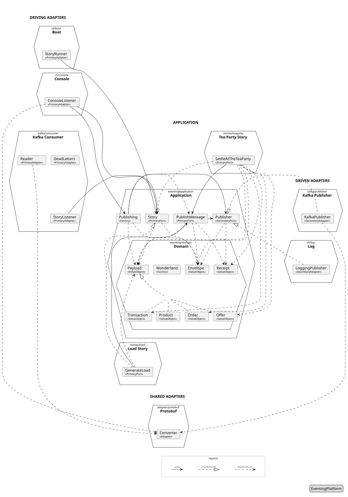

# Event Streaming Refresher

[](https://github.com/Mathmagicians/confluent-eventing-playground/actions/workflows/cicd.yaml)
[](https://github.com/Mathmagicians/confluent-eventing-playground/actions/workflows/iac.yaml)
[](https://github.com/Mathmagicians/confluent-eventing-playground/actions/workflows/load-run.yaml)
[](https://github.com/Mathmagicians/confluent-eventing-playground/actions/workflows/architecture-discovery.yaml)
[](https://github.com/Mathmagicians/confluent-eventing-playground/actions/workflows/cicd-client-example.yaml)

Reference implementation of an **eventing platform**, a proof of concept, that plays **stories**, a Kafka load
generator and stream consumers, against **Confluent Cloud**.

## Tech Stack
- Java 25 - newest LTS, finalized features
- Spring Boot 4.1.1 + Gradle 9.7.1 (Groovy DSL) - micro service framework, Spring Framework 7, wrapper committed
- Spring for Apache Kafka - producer and consumer
- Confluent Cloud - Kafka + Schema Registry
- Cucumber BDD - for black box testing, JUnit Platform engine
- JUnit 5, AssertJ, Mockito - unit tests
- jMolecules + ArchUnit - hexagonal stereotypes on ports, adapters, and application services, and the rule that
  enforces them
- Testcontainers - runs the image under test in the BDD suite
- Docker + Compose - starts the flock: the load generators and the stories that read them
- GitHub Actions - CICD + publish to GH registry, and hourly load runs
- Terraform + Terraform Cloud - topics and schemas on Confluent Cloud, provider `confluentinc/confluent`
- Container image - deployment unit, built with `./gradlew bootBuildImage`

<table>
  <tr>
    <td align="center"></td>
    <td align="center"></td>
  </tr>
  <tr>
    <td align="center">Powered by Confluent Cloud ...</td>
    <td align="center">... and Terraform Cloud</td>
  </tr>
</table>

## Purpose

- Playground for refreshing event-streaming fundamentals against a managed Confluent cluster: keys, partitions, ordering, idempotence, schemas.
- Generate repeatable load from GitHub Actions (hourly cron) and from a developer machine.
- Use stream processing capabilities from Confluent to consume over several topics

One topic per payload type, each keyed for a different ordering guarantee. Kafka keeps the records of one partition
in order, and the key picks the partition, so records with the same key stay in order.

```
 products   key = product     offers   key = region + product    orders   key = region

 p0 | P-POCK P-POCK P-POCK    p0 | EMEA/P-POCK EMEA/P-POCK       p0 | EMEA EMEA EMEA EMEA
 p1 | P-FANN P-FANN           p1 | APAC/P-POCK APAC/P-POCK       p1 | APAC APAC
 p2 | P-TEAS                  p2 | EMEA/P-FANN                   p2 | AMER AMER AMER

 ordered per product          ordered per product in a region    ordered per region

 transactions   key = customer

 p0 | C-01 C-01 C-01
 p1 | C-07
 p2 | C-02 C-02

 ordered per customer, a ledger
```

## Architecture

<table>
  <tr>
    <td align="center"></td>
  </tr>
  <tr>
    <td align="center">Diagram was <a href="architecture-discovery/architecture-discoverability.md">automatically generated</a>, with kudos to Alistair Cockburn, original: <a href="https://alistair.cockburn.us/hexagonal-architecture/">Hexagonal Architecture</a></td>
  </tr>
</table>

### Services

| Service           | Role                                                                                                                                  | Runs where                              |
|-------------------|---------------------------------------------------------------------------------------------------------------------------------------|-----------------------------------------|
| `load`            | The generator: produces one payload type to its topic. One image, many instances distinguished by type and region (`EMEA`, `AMER`, `APAC`, ...). | Compose flock, GitHub Actions cron |
| `tea-party`       | Reads a region's offers and orders, settles an order at the latest offer, publishes the transaction.                                | Compose flock                           |
| `purse`           | Reads the transactions, keeps what its owner has left. The example of a story built outside, `examples/purse/`.                     | Its own image                           |

All are stories of one Spring Boot application, the platform, one story per process, `--story=<name>`. Actuator
health and metrics are the endpoints it exposes.

### Domain

A payload is a `Product`, an `Offer`, an `Order`, or a `Transaction`, a sealed set. An event is an `Envelope` with a
payload.

- **The key picks the partition**, one key per topic as shown under Purpose. The default partitioner (murmur2 over
  the serialized key) maps a key to a partition by partition count, so the partition count of a topic is fixed at
  topic creation.
- A `Transaction` is keyed by its customer id, so a customer's transactions stay in order. Region and product ride
  in the headers and the payload, where stream processing reads them.
- **Keys are for ordering, headers are for stream processing.** A key is the partition contract and nothing else.
  What a query filters or joins on, region, id, source, type, time, travels in the CloudEvents headers, which Flink
  reads and writes as a metadata column.
- Serialization: Protobuf via Confluent Schema Registry.

### Hexagon

The platform is one hexagon, and every story a hexagon of its own beside it. The domain sits in the centre, the use
cases around it, and every technology, the command line, the log, Kafka, Spring, in an adapter at the rim.
Dependencies point inward: an adapter knows its port, a use case knows the domain and its ports, the domain knows
nothing outside itself.

```
 driving side                                                                            driven side

 command line    --> StoryRunner   --> Story --> PublishMessage --> Publisher --> LoggingPublisher --> the log
 Confluent Cloud --> StoryListener -->   |       use case           driven port   KafkaPublisher   --> Confluent Cloud
                                         |
                    GenerateLoad, SettleAtTheTeaParty, KnowWhatIsLeft: the stories, driving ports of their own
                                         |
                                       domain
                       Payload records, Envelope, Receipt, Wonderland
```

| Ring             | What lives there                                                                                              | Package               | Stereotype          |
|------------------|---------------------------------------------------------------------------------------------------------------|-----------------------|---------------------|
| Domain           | `Payload` and its records, `Envelope`, `Receipt`, `Wonderland`: the data, the key rules, the random recipes.  | `domain`              | none                |
| Use cases        | The driving ports, named in the features' words: `Story`, the contract every story implements, and `PublishMessage`; the stories `GenerateLoad`, `SettleAtTheTeaParty`, `KnowWhatIsLeft`, one jar each. Records, plain Java and SLF4J. | `application`, `stories/*` | `@PrimaryPort` |
| Driven ports     | What the use cases need from the outside: `Publisher`. Interfaces.                                            | `application`         | `@SecondaryPort`    |
| Driving adapters | What calls a use case: `StoryRunner`, the command line starting the story `--story` names; `StoryListener`, the consumer feeding it the topics it listens to. | `adapter/cli`, `adapter/kafka/consumer` | `@PrimaryAdapter` |
| Driven adapters  | What implements a driven port: `LoggingPublisher` for `local`, `KafkaPublisher` with `Topics` and `Converter` for `test` and `prod`. | `adapter/log`, `adapter/kafka/publisher` | `@SecondaryAdapter` |
| Composition root | `UseCases`, a `@Configuration` that wires the clock and picks the story; each story's auto-configuration builds the story from its settings, its ports, the clock, and the random source. | root, `stories/*` | none |

A use case takes what the generator has, a payload, and the driven port takes what the wire carries, an envelope:
`PublishMessage` makes the one from the other, and a story publishes through it. Use cases are records Spring never
sees: a story's auto-configuration wires them by hand from their ports, the clock, and the random source, and
`UseCases` picks the story `--story` names. The stereotypes are
jMolecules annotations, and `ArchitectureTest` runs `ensureHexagonal()` over them: a use case reaches driven ports,
other use cases, and the domain only, a driving adapter reaches use cases only, a driven adapter reaches driven ports
only, and nothing inside reaches an adapter.

### Data flow

```
 GitHub Actions cron (hourly)          developer machine
          |                                   |
          v                                   v
   load story (EMEA)   ...   load story (region N)
          |   key per topic, headers = envelope, value = payload
          v
   Confluent Cloud   topics: products, offers, orders, transactions, prefixed test. or prod.   (N partitions, fixed)
          |                                                      ^
          v                                                      |
   tea-party story (EMEA) ... (region N)   an order meets an offer, the transaction goes back up
          |
          v
   purse story   what its owner has left
```


## Repository layout

```
.
├── README.md                 this file: project and coding standards
├── Makefile                  the entry point for humans and CI: what only this repository has
├── platform.mk               the make targets every build on the platform shares, included by the Makefile and a story's own
├── platform.gradle           the Gradle conventions every build on the platform shares, applied by build.gradle and a story's own
├── compose.yaml              the flock: generators per region, the tea party
├── build.gradle / settings.gradle
├── platform/                 the eventing platform: domain, the Story contract, the adapters; its test fixtures are the shared BDD
├── stories/                  the stories of this repository, one jar each: load, tea-party
├── app/                      the distribution: the platform and the stories in one image, the architecture tests
├── examples/purse/           a story built as a client builds one, against the published platform, see its README
├── src/main/proto/           Protobuf schemas, registered by iac/; the generated code is committed under platform/src/generated
├── iac/                      Terraform: topics and schemas on the Confluent cluster, applied by Terraform Cloud
├── .github/workflows/        cicd.yaml, load-run.yaml, iac.yaml, architecture-discovery.yaml, cicd-client-example.yaml
├── architecture-discovery/   the library behind the hexagon diagram, and architecture-discoverability.md: its own build, its own workflow, published to GitHub Packages
└── docs/                     generated/architecture from the code, make arch-gen
```

Root package: `dk.mathmagicians.playground.confluent`. Packages by ring inside the platform: `domain` in the
centre, `application` around it, and `adapter` at the edge with one package per technology, `cli`, `log`,
`kafka/publisher`, `kafka/consumer`, see Hexagon under Architecture. A story is one package under `stories`. The
domain is one package, so a sealed type and its records stay package-private neighbours.

Tests live next to what they test:

```
src/test/java/...                unit tests, one class per production class
src/test/resources/features/     Gherkin features
src/test/java/.../bdd/           step definitions and test drivers
```

## Getting started

Prerequisites: JDK 25, Docker, the `gh` CLI for pipeline work, Terraform for `iac/`, Confluent Cloud API keys for
Kafka and Schema Registry.

The Makefile is the entry point for humans and CI. `make help` lists the targets by section, `make check` is the
CI gate.

### Configuration

#### Environments

| Profile | Publishes to    | Runs from                                                      |
|---------|-----------------|----------------------------------------------------------------|
| `local` | the log         | Developer machine, no credentials                              |
| `test`  | `test.<topic>`  | Developer machine, the `cd` job on every pull request          |
| `prod`  | `prod.<topic>`  | `load-run.yaml` hourly cron, developer machine with `ENV=prod` |

`test` and `prod` run against Confluent Cloud.

#### Variables and secrets

All environment-specific values come from environment variables, bound through `${...}` placeholders in the profile
properties files. `.env.private.sample` lists them. They live in three places:

- `.env.<ENV>.private`, `ENV` being `test` or `prod`, git-ignored. `make` sources the file for `ENV`, default
  `test`, into the command it runs.
- The GitHub environments `confluent-test` and `confluent-prod`: the endpoints as variables, the API keys as
  secrets. One Confluent cluster serves both, one topic prefix each.
- The Terraform Cloud workspace, as Terraform variables.

#### IaC

Terraform Cloud creates the topics and schemas from `iac/`, applied on every push to `main`. Its workspace holds
the cluster, the Schema Registry, and their API keys as Terraform variables, declared in `iac/variables.tf`. The
GitHub environment `terraform-cloud` holds `TF_API_TOKEN`, `TF_CLOUD_ORGANIZATION`, and `TF_WORKSPACE` for the plan
`iac.yaml` runs on every pull request. A developer machine runs `terraform login` once and keeps the organization
and workspace names in `.env.test.private`.

## Play
The application is a container image that plays one story per process, `--story=<name>`, `load` by default. Start
the flock with compose, see `compose.yaml` and the Flock section of `make help`, or start the image on its own:

```bash
docker run --rm confluent-eventing-playground:$(make version)
docker run --rm confluent-eventing-playground:$(make version) --load.type=order --load.concurrent=20 --load.interval=100 --load.region=APAC --load.ttl=120
docker run --rm ghcr.io/mathmagicians/confluent-eventing-playground:latest --load.type=product
docker run --rm ghcr.io/mathmagicians/confluent-eventing-playground:latest --story=tea-party --tea-party.region=EMEA
```
A story's settings are the bundle of its name. The tea party takes `--tea-party.region`, default `EMEA`, and reads
until stopped. The load story takes:

| Argument            | Values                    | Default |
|---------------------|---------------------------|---------|
| `--load.type`       | `offer`, `order`, `product` | offer |
| `--load.concurrent` | producers running the loop | 10     |
| `--load.interval`   | milliseconds a producer sleeps between events | 250 |
| `--load.region`     | stamped on every event    | EMEA    |
| `--load.ttl`        | seconds to run, max 300   | 60      |

A wrong value fails startup with the reason.

## Coding standards

A review finding cites the rule it breaks.

### Principles

1. **DRY, then readable.** Extract when a second copy of the same knowledge appears.
2. **SOLID.** One responsibility per class, narrow interfaces, dependencies injected through the constructor.
3. **Functional style.** Immutable data, pure functions, side effects at the edges: Kafka, clock, logging.
4. **Behaviour first.** A change starts with the Gherkin scenario or unit test that describes it.
5. **Hexagonal architecture.** Domain in the centre, use cases around it, Kafka and Spring in adapters at the edges,
   see Hexagon under Architecture. The architecture is a test: `ArchitectureTest` fails the build when the core
   reaches an adapter or an adapter bypasses its port.

### Java 25

- Toolchain is Java 25, finalized features. Expected wherever they fit:
  - `record` for every value type: events, configuration properties, test data.
  - `sealed` interfaces with exhaustive `switch` pattern matching for closed hierarchies.
  - Record deconstruction patterns in `switch` and `if`.
  - Unnamed variables `_` for ignored lambda parameters and catch variables.
  - Virtual threads for blocking work, enabled with `spring.threads.virtual.enabled=true`.
- `var` for locals when the right-hand side names the type, an explicit type otherwise.
- `Optional` is a return type. Fields, parameters, and collection elements use the plain type.
- Public boundaries express absence with `Optional`, an empty collection, or a sealed result type. JSpecify
  `@Nullable` marks where `null` crosses a boundary.
- The domain throws unchecked, domain-specific exceptions. Checked exceptions are wrapped at the boundary where they
  arise.
- All output goes through SLF4J.
- Behaviour lives on the type that owns the data.

### Spring Boot

- Configuration as `@ConfigurationProperties` records, validated in the compact constructor with a message that
  carries the value, injected where needed.
- Auto-configuration first. A `@Bean` method covers what auto-configuration cannot express and carries a one-line
  comment saying so.
- Profiles are `local`, `test`, and `prod`. `local` publishes every envelope to the log at INFO and needs no
  credentials, the other two publish to Kafka and differ in properties: the topic names.
- `application.properties` holds defaults, `application-<profile>.properties` holds the profile. Secrets are
  `${ENV_VAR}` placeholders that fail fast when unset. Everything else has a default.
- `@SpringBootTest` serves one wiring test per service and the BDD suite.
- Spring Boot 4 specifics: `@MockitoBean` and `@MockitoSpyBean` for test doubles in the context. Nullness follows
  JSpecify.

### Kafka and Confluent Cloud

- Producer: `acks=all`, `enable.idempotence=true`, compression `lz4` or `zstd`, explicit `linger.ms` and `batch.size`.
  All of it through Spring properties, each tuning value with a comment.
- Every record has a key.
- Topics and their schemas are created by Terraform Cloud from `iac/`. Test containers auto-create.
- Topic names are `<env>.<topic>`, the environment `test` or `prod` first: `test.orders`. The dot is the only
  separator.
- Consumer group id is explicit and named after the story. Offset management stays on Spring defaults until a
  scenario needs otherwise.
- Listener exceptions propagate to Spring's `DefaultErrorHandler`, which publishes to the dead-letter topic
  `<topic>.DLT`, Spring's default name and partition, through `DeadLetterPublishingRecoverer`.
- One serialization class per direction owns `byte[]` and serializer configuration. Business code works with
  `Envelope`.
- Every message carries its envelope as record headers, CloudEvents binary mode: `ce_specversion`, `ce_id`,
  `ce_source`, `ce_type`, the message's full name, `ce_time` in RFC 3339, and the extension `ce_region`; its payload
  is the value, so a topic's value schema is its payload type and stream processing reads the topic directly. A
  statement that writes a topic writes the same headers. The `Envelope` message in `envelope.proto` documents the
  thin-envelope alternative and stays off the wire.
- Schema evolution: `BACKWARD` compatibility, `TopicNameStrategy`, schemas checked in under
  `src/main/proto`, one file per payload, registered by `iac/` under its topic's `<topic>-value` subject,
  imports as schema references. A producer runs with `auto.register.schemas=false` and `use.latest.version=true`.
- Confluent Cloud clients use `SASL_SSL` with `PLAIN`. Every other setting stays at the Confluent-recommended default
  until a measurement justifies a change.

### Testing

Test layers:

| Layer | Tool                                              | Scope                                          | Speed   |
|-------|---------------------------------------------------|------------------------------------------------|---------|
| Unit  | JUnit 5, AssertJ, Mockito                         | One class in isolation                         | ms      |
| BDD   | Cucumber, Testcontainers running the image        | One feature end to end: the image against the Confluent test cluster | seconds |
| Load  | GitHub Actions against Confluent Cloud            | the latest image, hourly, measured             | minutes |

Unit tests:

- One test class per production class, same package, named `<Class>Test`.
- Method names describe behaviour in the present tense: `rejectsNegativeQuantity`.
- Arrange, act, assert, separated by blank lines. One behaviour per test.
- AssertJ for every assertion.
- Mock what you own and what does I/O. Records, collections, and Kafka client types come from the fixtures.
- Test data comes from builders or factory methods in `*Fixtures` classes.

BDD with Cucumber:

- A feature file describes one capability in domain language. Topics, ordering, and schemas are domain concepts in
  this project and belong in features: a schema is what data stewards govern, so a feature names the schema a topic
  carries. Partition counts, class names, ports, and client configuration belong in step definitions and drivers.
- `Given` sets up state, `When` is one action, `Then` asserts an observable outcome. Up to three `And` steps per
  keyword.
- `Scenario Outline` for variations of one behaviour. Separate scenarios for separate behaviours.
- Step definitions are glue: one line delegating to a test driver class. Assertions live in the driver.
- Test code follows the rules of its framework: `public` step classes for Cucumber, drivers as beans of the suite's
  context.
- Steps are shared across features. Search for an existing step before writing one.
- Features run through the JUnit Platform Suite engine as part of `make check`. A red feature blocks the build.
  The report is `build/reports/cucumber/index.html`; the `cd` job prints the scenarios in its summary and uploads
  the report as the artifact `cucumber-report`.

### Naming and structure

- Classes are nouns naming a domain concept or an actor: `Order`, `OrderProducer`.
- Methods are verbs. Boolean methods read as predicates: `isOrdered`, `hasKey`.
- Constants are `UPPER_SNAKE`, defined in the type that uses them.
- One public type per file. Package-private by default, `public` when another package needs it.
- A method fits on one screen.

### Logging and observability

- SLF4J with parameterised messages: `log.info("Produced {} orders for {}", count, region)`.
- `ERROR` means a human should look. `WARN` means degraded but running. `INFO` is lifecycle and counts. `DEBUG` is
  per-message detail, off by default.
- Log lines carry identifiers and counts. Payloads appear at `DEBUG`, stack traces at `ERROR`. The `local` profile
  is the exception: the log is its publisher, so every envelope appears at `INFO`.
- Micrometer counters and timers for produced and consumed records.

### Dependencies and build

- Versions come from the Spring Boot BOM. A hard-coded version carries a comment with the reason and the date.
- Project code compiles with zero warnings under `-Xlint:all -Werror`.
- Formatting: Spotless with google-java-format, AOSP style (4 spaces). `./gradlew spotlessApply` before commit, CI
  runs `spotlessCheck`.
- The Protobuf serializer comes from the Confluent Maven repository (`https://packages.confluent.io/maven/`).

### Git and CI

- Default branch `main`. Short-lived branches: `feat/<topic>`, `fix/<topic>`, `chore/<topic>`.
- Conventional Commits: `feat:`, `fix:`, `test:`, `chore:`, `docs:`, `ci:`, `build:`. Imperative subject under 72
  characters. The body says why.
- Every PR has a green `ci`, `cd`, and `iac`, and a review before a human merges.
- The version is Gradle's, derived from git tags: `1.2.3` at tag `v1.2.3`, `1.2.4-SNAPSHOT` after it,
  `0.0.1-SNAPSHOT` before the first tag. `make version` and `make next-version` print them.
- `cicd.yaml`, job `ci`, runs on pull requests to `main`, on pushes to `main`, and on `workflow_dispatch`:
  generated-check, arch-verify, build with unit tests, the platform, its test fixtures, and the stories as a
  snapshot to GitHub Packages, container image, then publishes the build to
  `ghcr.io/mathmagicians/confluent-eventing-playground` as a candidate tagged `sha-<short sha>`. A pull request
  adds `pr-<number>`, a push to `main` adds `latest`. Only `main` moves `latest`.
- `cicd.yaml`, job `cd`, follows `ci`: it deploys to test by running the integration tests, `make bdd-published`,
  against the candidate, with the credentials of the `confluent-test` environment. A green `cd` on a pull request
  is what says the build can be promoted.
- `cicd.yaml`, job `tag`, follows `cd` on `main`: `make git-release` puts a git tag `v<version>` on the tested
  commit and the same version on the candidate image in the registry, and the platform's jars go to GitHub
  Packages under it, the same bytes `ci` built. `make git-tag` is the git part alone. The version is Gradle's next,
  or the `workflow_dispatch` input, e.g. `0.1.0`.
- A minor or major version is a `workflow_dispatch` of `cicd.yaml` on `main` with the version. The merge before
  it would tag the next patch by itself, so pause the workflow around the merge: `gh workflow disable cicd.yaml`,
  merge, `gh workflow enable cicd.yaml`, then `gh workflow run cicd.yaml --ref main -f version=<version>`.
- `load-run.yaml` runs hourly (`0 * * * *`) and on `workflow_dispatch` with one input, the load arguments. It
  generates load in production: the `latest` image with the `prod` profile, `make docker-smoke` when the arguments
  are empty and `make docker-run` otherwise, with the credentials of the `confluent-prod` environment. No `latest`
  image, no run.
- `iac.yaml` runs on the same events as `cicd.yaml` and does its work when `iac/` changed, so it can be a required
  check while a run with nothing to do is green in seconds: `make tf-check`, then `make tf-plan`, the speculative plan
  written to the job summary, with the credentials of the `terraform-cloud` environment. Terraform Cloud applies
  `iac/` on `main` through its GitHub connection.
- `architecture-discovery.yaml` runs on the same events as `cicd.yaml` and does its work when
  `architecture-discovery/` changed, the same way: `make discovery-build`, then `make discovery-publish`, the
  library's snapshot to GitHub Packages, where `ci` and `cd` resolve it.
- `cicd-client-example.yaml` runs on the same events as `cicd.yaml` and does its work when `examples/purse/` or the
  shared build files changed, the same way: the example's build, its image, its features against the test cluster,
  and its image to the registry, as a client's own cicd would.
- `main` is protected: changes arrive by pull request with a green `ci`, `cd`, `iac`, `architecture-discovery`,
  and `cicd-client-example`, no force pushes, linear history.
  `.github/branch-protection.json` is the setting, `make gh-main-protection` applies it.

## Definition of done

- Unit tests cover the new class or the changed branch.
- `make check` passes locally, `make bdd` included. `make run-tiny` is the quick start.
- Every new dependency is noted in the PR.
- README updated if a standard, variable, or architectural decision changed.
- Review findings above Nit are resolved or explicitly deferred with a reason.

## Roadmap

- [x] Install Java 25
- [x] Hello world
- [x] Gradle script builds and runs the unit test
- [x] Makefile with `build`, `test`, `bdd`, `run`, `check`
- [x] Local docker compose spins up a flock of workers
- [x] workers can generate load, and convert it to protobuf
- [x] Topics, dead-letter topics, and schemas created by Terraform Cloud from `iac/`
- [x] workers can publish against test.* kafka topics
- [x] Prod docker flock works against prod.* kafka topics
- [x] Cucumber wired into the build (JUnit Platform Suite, Testcontainers for workers, Confluent test.* topics)
- [x] BDD feature: I can publish messages
- [ ] BDD feature: same key ends up in the same partition
- [x] Partition key strategy defined per payload type
- [x] Publish Ks of messages to Confluent Cloud
- [x] Stories: a business process as a jar the platform plays, `--story=<name>`, one consumer group each
- [x] A story built outside the repository against the published platform, `examples/purse/`
- [ ] Stream consumer service: the tea party settles, the purse counts
- [x] Protobuf via Schema Registry
- [x] Split into modules
- [x] Convert to hexagonal
- [x] GitHub Actions `cicd.yaml`
- [x] GitHub Actions `load-run.yaml`, hourly cron
- [x] Auto discover architecture, verify architecture rules, generate diagrams, and check for drift

## License

MIT, see `LICENSE`.
