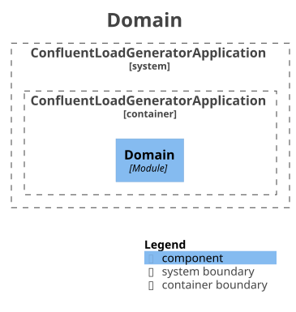
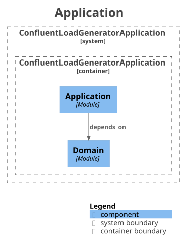
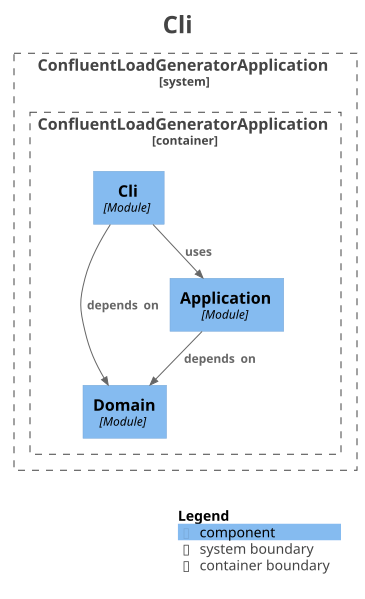
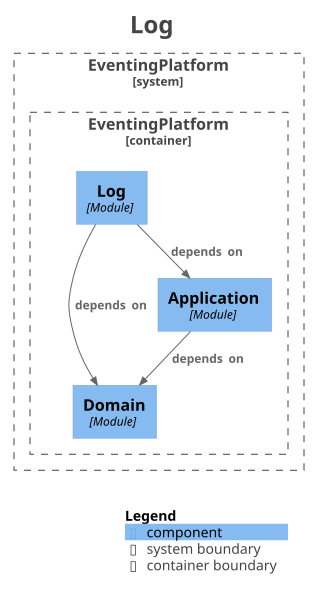
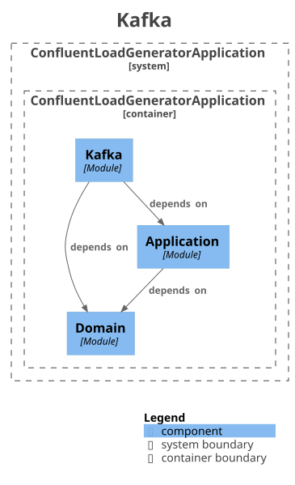

# Architecture discoverability

Here, we experiment a bit with auto disovery of architecture, automated verification of architecture, and automated generation of documentation.
The architecture layers are annotated in the code, and that information is used to:
- verify the architecture (is hexagonal) `make arch-verify`
- generate diagrams and canvases `make arch-gen`


The picture is owing to Alistair Cockburn's classic, [Hexagonal Architecture](https://alistair.cockburn.us/hexagonal-architecture/),
2005: the application in the middle, driving adapters on one side, driven adapters on the other, ports on the
hexagon's edges.

## Architecture Discovery Pipeline

1. **Stereotypes on types.** jMolecules hexagonal annotations name the role of each type: `@PrimaryPort` on the
   use cases `PublishMessage` and `GenerateLoad`, `@SecondaryPort` on `Publisher`, `@PrimaryAdapter` on
   `LoadRunner`, `@SecondaryAdapter` on `LoggingPublisher` and `KafkaPublisher`. Domain types carry none.
2. **Modules on packages.** jMolecules `@Module` on the `package-info.java` of `domain`, `application`,
   `adapter.cli`, `adapter.log`, and `adapter.kafka`. Spring Modulith takes these as the application modules, set by
   `spring.modulith.detection-strategy=explicitly-annotated` in `application.properties`.
3. **The rule.** `ArchitectureTest` imports the main classes with ArchUnit and runs
   `JMoleculesArchitectureRules.ensureHexagonal()`, a layered architecture whose layers are the stereotypes, at the
   strict depth. It fails when a use case reaches an adapter, an adapter reaches core code that is not a port, a
   driving adapter reaches a driven port, or an adapter reaches an adapter of the other kind.
4. **Module verification.** `ArchitectureDocumentationTest` runs `ApplicationModules.verify()`: no cycles between
   modules, and a module reaches another only through its API package. Steps 3 and 4 are unit tests, so
   `make build` runs them; `make arch-verify` runs the two alone.
5. **Documents.** The same test class carries a tagged writer, run by the Gradle task `generateArchitecture`. It
   runs Spring Modulith's `Documenter` into `docs/generated/architecture/plantuml`: `components.puml`, a C4
   component diagram of the modules and their dependencies, one `.puml` per module with its direct dependencies,
   one `.adoc` canvas per module, and `all-docs.adoc` linking them. Then it runs `HexagonDocumenter` from the
   `architecture-discovery` library into `hexagon.puml`: the modules as a hexagon, driving adapters left, driven
   adapters right, the application in the centre with the domain nested inside it, the application's own types
   in a row above the domain. Inside each module, every type with a stereotype is a card with its role, laid out
   in a grid, the permitted types of a sealed type in a row under it, implementing it. `HexagonDocumenter.Options`
   caps the types listed per role, unlimited by default, an ellipsis line with the total beyond the cap.
   The roles come from jMolecules' stereotype catalogs, the `META-INF/jmolecules-stereotypes.json` in each jar,
   read by `jmolecules-stereotype`.
6. **Rendering.** The Gradle task `renderDiagrams` runs PlantUML over the `.puml` files and writes one `.svg` per
   diagram to `docs/generated/architecture/svg`, with PlantUML's built-in layout engine, so Graphviz is not needed.
   `make arch-gen` runs steps 5 and 6.
7. **Drift guard.** `make arch-check` runs `arch-gen` and fails when the result is not in git as regenerated:
   files not added, or PlantUML sources whose content changed. `make generated-check` runs it with `proto-check`,
   and is the first step of `make build`, `make check`, and the CI job.

## Targets

| Target | Question it answers | Fails when |
|---|---|---|
| `make arch-verify` | Is the code shaped as declared? | A class reaches across a ring or a module boundary |
| `make arch-gen` | Show me the shape. | The toolchain is broken |
| `make arch-check` | Are the committed documents current? | The documents drift from the code |

## Tech stack

| Tool | Artifact | Scope | Role |
|---|---|---|---|
| jMolecules hexagonal annotations | `org.jmolecules:jmolecules-hexagonal-architecture`, BOM 2025.0.2 | main | the stereotypes |
| jMolecules DDD annotations | `org.jmolecules:jmolecules-ddd`, same BOM | main | `@Module` on packages |
| ArchUnit | `com.tngtech.archunit:archunit-junit5` 1.5.0 | test | class import, rule engine, JUnit 5 binding |
| jMolecules ArchUnit rules | `org.jmolecules.integrations:jmolecules-archunit`, same BOM | test | `ensureHexagonal()` |
| Spring Modulith | `org.springframework.modulith:spring-modulith-starter-test`, BOM 2.1.1 | test | module model, `verify()`, `Documenter` |
| jMolecules stereotype catalog | `org.jmolecules.integrations:jmolecules-stereotype`, same BOM | through the library | reads the catalogs, answers a type's stereotypes |
| architecture-discovery | `dk.mathmagicians.playground:architecture-discovery`, this folder, published to GitHub Packages | test | `HexagonDocumenter` |
| PlantUML | `net.sourceforge.plantuml:plantuml-mit` 1.2026.8 | the `plantuml` configuration | renders `.puml` to `.svg` |

Versions are pinned in `build.gradle` with the date, since none of them is in the Spring Boot BOM.

## Output

```
docs/generated/architecture/
  plantuml/                              step 5, written by generateArchitecture
    hexagon.puml                         the hexagon: modules by side, their stereotyped types with roles
    components.puml                      C4 component diagram, all modules
    module-eventing.<module>.puml        one module and its direct dependencies
    module-eventing.<module>.adoc        the module canvas
    all-docs.adoc                        links the diagrams and canvases
  svg/                                   step 6, rendered by renderDiagrams
    hexagon.svg
    components.svg
    module-eventing.<module>.svg
```

## Modules

| `domain` | `application` |
|---|---|
|  |  |

| `adapter.cli` | `adapter.log` | `adapter.kafka` |
|---|---|---|
|  |  |  |

## Limits

- The canvases list Spring beans, jMolecules DDD stereotypes, and configuration properties found in a module's API
  package. Hexagonal stereotypes are not in their vocabulary, and package-private adapters are not API, so the
  `application` canvas shows its package only and the `kafka` canvas shows `Topics`.
- The `Documenter` writes the dependency lines of `components.puml` in varying order between runs, and the SVG
  follows that order. `arch-check` therefore compares the PlantUML sources line-sorted and requires the SVG files
  to be in git without comparing their bytes. A deterministic order in the `Documenter` would make the check exact.
